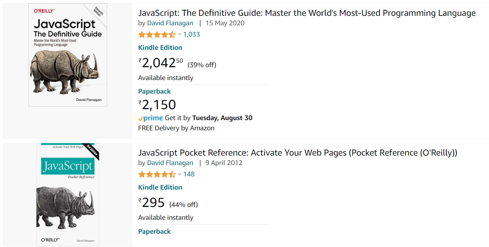

:books: **DAY2**  


:beginner: _**USER STORY 3**_
- As a user, I need data transfer functionality for the form below.
  


:writing_hand: **_Requirements_**
  
  - Input Details should be transferred to the table format below:
  
| Label | Value |
|-|-|
| First Name | "Rambo" |
| Last Name | "John" |

- the table shoud be on the same html form

:bulb: transfer as it is typed, or when field loses focus or on submit.


:beginner: _**US04**_  
As a user, I need to store books in my cart as below.
  

:writing_hand: **_Requirements_**
  
  - Each book be stored in a Book class
  - Store 2 or more books in booksCartArray with image
  - Render the cart dynamically on the page in a table of 2*2
  - Have a button Load Cart to perform the functionality.


==========================================
:book: **EXPLORATORY LABS**  

:beginner: _**US05**_  
As a user, I need to access and manipulate a set. 

:writing_hand: **_Requirements_**
  
  - accept a service value from the user and print "We provide / do not provide such and such a servie"
  - add another object similar to the one added.
  - search for a location and print the service.


```ts
const services = new Set();
services.add('consulting');
services.add('iot');
services.add('monetization');
console.log(services);
services.add( {
    service : 'consulting',
    loc : 'mumbai',
    description : 'IT consulting services'
});
```


:beginner: _**US06**_  
As a developer, I need to understand the challenges with variables in javascript by implementing a calculator program.

:writing_hand: **_Requirements_**
- perform add, mul and div operations
- using classes, constructors, functions, var, let and const variables


:beginner: _**US07**_  
As a developer, I need to understand the internals of a workking program and fix issues.

:writing_hand: **_Requirements_**
- step in, step over, step out, resume operations
- use various debugging windows to track stat and values
- test var, let and const variables and check thier scopes.