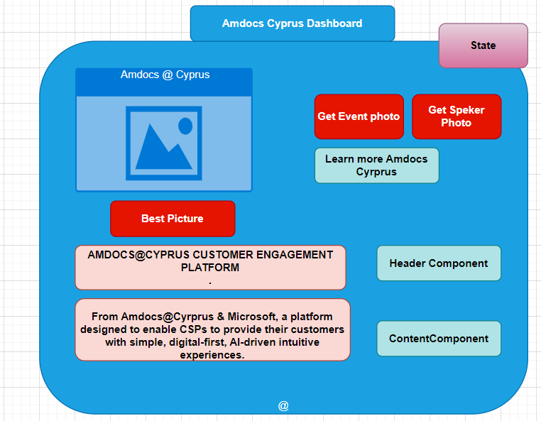

:one: _Lab1_  : Build a dashboard card inspired from our official site Amdocs.com  
  

:two: _Lab2_ : Debug the react application built during our prerivous lab with react developer & chrome developer tools. 

:three: _Apply the React way of Design and thinkig to build this Dashboard!_  

:four: _Explore debugging redux and time travel._  

:five: _Deploy the Dashboard to AWS Cloud._  

:beginner: _**Final Lab**_  
:point_right: Experimental and exploratory lab with Pair Programming on GraphQL, React Native, Typescript & Router & the Javascript EcoSystem.  

